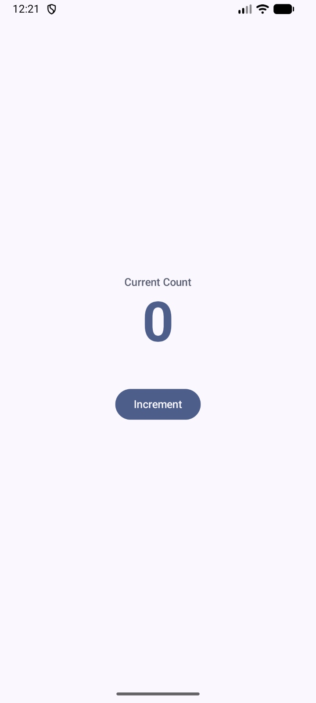
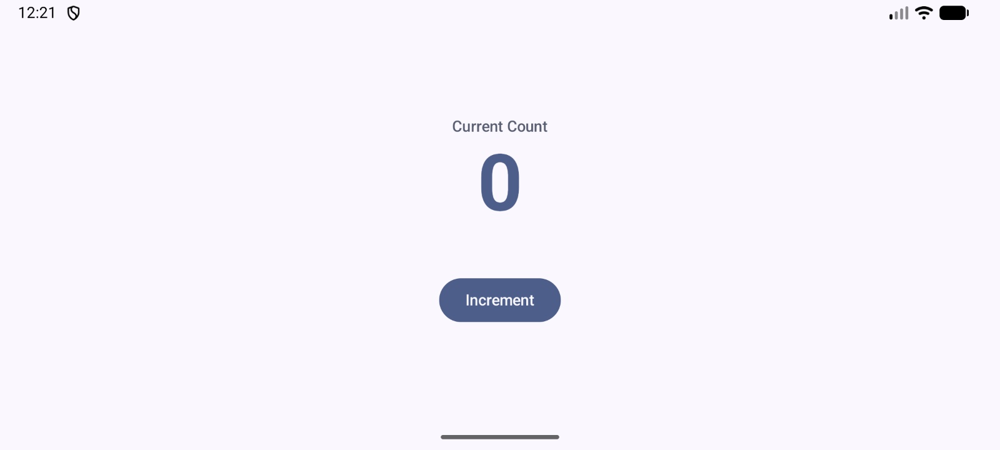

# README

## Student Information
- Name: Ashish Joshi
- Assignment: Midterm Exam (Q2 - ViewModel + Unidirectional Data Flow)

---

## Overview
This task refactors the counter UI so that the counter state is managed by a `ViewModel` instead of being stored directly inside the composable. The composable reads the state from the `ViewModel`, sends user actions upward, and recomposes automatically whenever the state changes.

---

## Features
- Displays a counter starting at `0`
- Uses a `CounterViewModel` to store and manage the counter state
- `CounterScreen` reads the state from the `ViewModel`
- Button presses call a function inside the `ViewModel`
- UI automatically recomposes when the counter value changes
- Follows Unidirectional Data Flow (UDF)

---

## Approach

### 1. ViewModel for State Management
The counter state is moved out of the composable and stored inside `CounterViewModel`.  
This keeps the UI separate from the business logic and makes the screen easier to manage and maintain.

### 2. Reading State in the Composable
`CounterScreen` gets an instance of `CounterViewModel` using `viewModel()` and reads the counter value from it.

### 3. Sending Events Upward
The composable does not directly change the counter.  
Instead, when the Increment button is pressed, it calls a function in the `ViewModel` (`onIncrement()`).

### 4. Automatic Recomposition
Because the composable observes state from the `ViewModel`, Compose recomposes the UI whenever the count changes.

---

## Unidirectional Data Flow
This solution follows Unidirectional Data Flow:

- **State flows down**: `CounterViewModel` provides the `count` value to `CounterScreen` / `CounterContent`
- **Events flow up**: button clicks call `onIncrement()` in the `ViewModel`

This makes the code cleaner and more predictable.

---

## Files / Structure
- `CounterViewModel`  
  Stores the counter state and handles increment logic

- `CounterScreen`  
  Connects the `ViewModel` to the UI

- `CounterContent`  
  Stateless UI composable that displays the current count and increment button

---

## Screenshots

### Portrait Mode

### Landscape Mode

---

## Testing
- Verified that the counter starts at `0`
- Verified that pressing **Increment** increases the value by 1
- Verified that the composable reads the updated state from the `ViewModel`
- Verified that the UI recomposes correctly after each button press
- Verified the layout in both portrait and landscape orientations

---

## Assumptions
- Only increment behavior was required in this question
- No reset functionality was required for Q2
- The main requirement was moving state management from the composable to the `ViewModel`

---

## AI Usage Disclosure
ChatGPT was used to:
- Help solve minor errors
- Assist with formatting and structuring the README
- Review the solution against the question requirements

All implementation, logic, and final code were written and understood by me.

---

## Final Note
This solution focuses on proper ViewModel-based state management, clean separation of UI and logic, and correct use of unidirectional data flow in Jetpack Compose.
